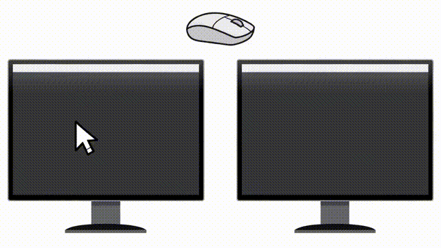

# 双屏鼠标穿透锁定 — 使用说明

程序基于 AutoHotkey v2.0 开发

版本：1.2.2　|　适用：Windows 10/11 双屏（双显示器）用户

---

## 一、软件简介

双屏鼠标穿透锁定是一款双显示器鼠标辅助工具：

- **一键穿透**：鼠标可以在主屏与副屏之间自由穿越
- **智能锁定**：锁定模式下鼠标被限制在指定屏幕内，防止误滑到另一块屏幕
- **副屏媒体控制**：不改变当前焦点，即可暂停/播放副屏上的视频（浏览器/播放器等）
- **副屏按键发送**：长按穿透键，可向副屏最顶层的任意程序发送自定义按键/组合键
- **主屏幕可选**：双屏中哪一块是"主屏"、哪一块是"副屏"，可随时切换并自动记忆
- **一键暂停**：托盘勾选"暂停运行"即可让鼠标完全自由，不锁定
- 常驻系统托盘，所有功能均可通过托盘右键菜单操作

## 二、快捷键（默认，可在托盘菜单中修改）

| 快捷键 | 功能 |
|---|---|
| **Ctrl+Num\*** （单击）| 解锁/锁定鼠标穿透 |
| **Ctrl+Num\*** （双击）| 暂停/播放副屏上的媒体（视频/音乐）|
| **Ctrl+Num\*** （长按 ≥0.5 秒）| 向副屏最顶层的程序发送自定义按键（默认 LShift+Win+Left，把副屏最顶层窗口快速移到主屏）|
| **Ctrl+Num/** | 暂停/恢复鼠标锁定（鼠标完全自由）|

> 提示：小键盘的 `*` 键位于小键盘区，`/` 键同理。所有快捷键都可在托盘右键 →"穿透键 / 暂停恢复键 / 按键发送到副屏"中改为任意组合键或单键（支持鼠标中键/侧键），修改后自动保存。左右 Ctrl/Shift/Alt 分开识别：按右 Ctrl 就显示 `RCtrl`，按左 Ctrl 显示 `LCtrl`。

## 三、长按发送副屏按键

长按穿透键 **0.5 秒**（松手前保持按住），会把设置的按键发送到**副屏当前最顶层的程序**（记事本、浏览器、播放器等任何应用）：

- **默认 LShift+Win+Left**：利用系统快捷键"窗口左移"，把副屏最顶层的窗口**快速移到主屏**—— 比如副屏在放视频，长按一下就把播放器窗口挪回主屏操作
- **支持任意按键**：单键（字母、空格等）与组合键（如 `Ctrl+R` 强制刷新浏览器、`Alt+A` 触发截图工具全局热键）均可
- 发送方式自动适配：普通程序投递到焦点控件；浏览器/全局热键使用真实按键注入，无需副屏获得焦点
- 设置方法：托盘右键 →"按键发送到副屏 (当前键)"，按新的组合键或单键即可，自动记忆

## 四、锁定模式（托盘"启用模式"二级菜单切换，自动记忆）

右键托盘图标 →"启用模式"，弹出二级菜单，可在两种模式间切换：

- **只锁定主屏（默认）**：锁定时鼠标限制在主屏；解锁穿透到副屏后自由活动，回到主屏自动重新锁定；**解锁后 3 秒内未穿到副屏，自动重新锁定**
- **主副屏单独锁**：锁定时鼠标被限制在鼠标当前所在的屏幕（在主屏就锁主屏，在副屏就锁副屏）

## 五、主屏幕选择

托盘右键 →"主屏幕设置"二级菜单，点击"显示器1 / 显示器2"即可切换哪块屏幕作为"主屏"（穿透锁定的基准屏），切换后自动记忆，重启不丢失。菜单项带短设备名（如 `显示器1 · DISPLAY16`），两块屏分辨率相同时也能分清。

**主屏识别顺序**（便携屏插拔、换电脑后照样认得）：

1. 设备名匹配（同一会话内唯一）
2. 分辨率匹配 —— 仅当**恰好一块屏**分辨率等于记忆值才采用；两块屏同分辨率时自动放弃、改认系统主屏，不会猜错
3. 都认不出 → 系统主屏（Windows 按硬件记忆，插拔稳定）

## 六、托盘右键菜单

| 菜单项 | 功能 |
|---|---|
| 启用模式 (只锁定主屏) ▸ | 二级菜单：只锁定主屏 / 主副屏单独锁（括号内为当前模式，打勾项为当前项）|
| 快捷键判定时间***ms | 修改单击/双击判定时间（长按自动 +30ms，最低 150）|
| 穿透键 (LCtrl+Num\*) | 重新设置穿透快捷键（括号内为当前生效键）|
| 暂停/恢复键 (LCtrl+Num/) | 重新设置暂停/恢复快捷键（括号内为当前生效键）|
| 按键发送到副屏 (Win+LShift+Left) | 重新设置长按发送的按键（括号内为当前生效键）|
| 开机启动 | 开关开机自启动（写入当前用户启动项，默认关闭）|
| 操作提示 | 开关屏幕操作提示气泡（默认开启）|
| 暂停运行 | 勾上=暂停锁定（鼠标完全自由），与暂停/恢复键同一开关，不写配置文件|
| 主屏幕设置 (显示器1) ▸ | 二级菜单：显示器1 / 显示器2，切换主屏幕（括号内为当前主屏，打勾项为当前项）|
| 软件说明 | 打开内置说明窗口（含作者、Gitee/GitHub 开源链接，点击自动跳转）|
| 退出 | 退出程序（自动释放鼠标锁定）|

> 菜单直接显示各项当前生效的快捷键与当前模式/主屏；修改后菜单自动刷新。

## 七、配置文件

- 配置文件为**与脚本同名的 .ini 文件**（如 `双屏鼠标穿透锁定.ini`），位于脚本所在目录
- 自动保存：锁定模式、操作提示开关、主屏幕、自定义快捷键、长按发送按键
- 快捷键以**人类可读格式**存储（如 `LCtrl+Num*`、`Win+LShift+Left`），每项配置上方带注释说明
- 主屏记录双保险：`primaryMonitor`（设备名）+ `primaryRes`（分辨率特征），便携屏插拔后靠分辨率找回
- **升级自动继承**：旧版配置（固定名 `双屏锁定配置.ini`，或上一版本的 `双屏鼠标穿透锁定v1.2.1.ini`）首次运行会自动复制过来，设置不丢

## 八、特殊说明

- **任务管理器 / 提权窗口**：当焦点在任务管理器等管理员权限窗口时，鼠标会自动临时放行（锁不住管理员窗口是系统安全机制），离开后自动恢复锁定
- **副屏媒体控制**：双击穿透快捷键可暂停/播放副屏浏览器视频（如 B 站、视频网站），不抢主屏焦点、不打断主屏操作；播放器类（PotPlayer、音乐播放器等）同样支持（走系统播放键，全屏/窗口均有效）
- **3 秒自动重锁**：仅"只锁定主屏"模式生效——解锁后 3 秒内未把鼠标穿到副屏，自动回到锁定状态，防止忘记重新锁定
- **暂停运行**：托盘勾选后鼠标完全自由（锁定暂停），适合临时把鼠标交给别人操作；再点一下或按暂停/恢复键恢复

## 九、常见问题

**Q：为什么任务管理器里鼠标锁不住？**
A：任务管理器以管理员权限运行，普通程序无法限制其鼠标，属于系统安全机制。本工具检测到此类窗口会自动放行，离开后恢复锁定。

**Q：双击快捷键后副屏视频没有暂停？**
A：请确认副屏正在播放视频（浏览器窗口在副屏上）。如果视频网站不支持空格键暂停，可换用支持键盘控制的网站或播放器。

**Q：长按发送按键，副屏程序没反应？**
A：长按发送的是"副屏最顶层"窗口，请确认目标程序确实在副屏最上层（没有被其他窗口遮挡）。个别程序（如 PotPlayer 的播放信息等程序内快捷键）会忽略脚本注入的按键，属程序自身限制。

**Q：如何完全退出程序？**
A：托盘图标右键 →"退出"。程序退出时会自动释放鼠标锁定。

**Q：开机启动为什么默认关闭？**
A：出于隐私与习惯考虑默认关闭，需要时在托盘菜单手动开启，也可随时关闭。

## 十、运行环境

- Windows 10 / 11（64 位）
- 双屏或双显示器配置
- 无需安装，直接运行（绿色免安装）

## 十一、作者

作者：圣骷髅

## 十二、版本更新记录

**v1.2.2（2026-10-05）**

- **新增**：托盘"暂停运行"勾选项—— 勾上=暂停锁定（鼠标完全自由），与"暂停/恢复键"同一个开关，不写配置文件、默认不勾选
- **修正**：改快捷键捕捉组合键不完整（按住 Ctrl/Shift/Alt/Win 再按主键时修饰键经常丢失）—— 改为键盘钩子实时记录修饰键，左右 Ctrl/Shift/Alt 与 Win 都能正确拼进组合键
- **优化**：主屏识别升级—— 设备名 → 分辨率（仅唯一匹配）→ 系统主屏 三级兜底；便携屏插拔、换电脑后照样认得主屏；两块屏同分辨率时不猜、自动落系统主屏
- **优化**：托盘"主屏幕设置"菜单项带短设备名（如 `显示器1 · DISPLAY16`），同分辨率的两块屏也能分清
- **优化**：代码整体再重排精简—— 核心功能（锁定检测、穿透键三态、媒体控制）前置，按键发送、快捷键注册、改键钩子集中，托盘菜单/设置项归组，配置模板与启动流程收尾
- **优化**：配置文件升级自动继承—— 新版首次运行自动复制上一版本的 ini（或旧固定名配置），快捷键、判定时间、锁定模式等设置无缝迁移
- **变更**：菜单项"发送到副屏按键"改为"按键发送到副屏"

**v1.2.1（2026-09-30）**

- **新增**：托盘"启用模式"二级菜单（只锁定主屏 / 主副屏单独锁），标题实时显示当前模式
- **新增**：托盘"主屏幕设置"二级菜单（显示器1 / 显示器2），标题实时显示当前主屏
- **新增**："软件说明"窗口—— 内置功能说明、作者信息，Gitee(国内)/GitHub(国外) 开源链接一键跳转
- **优化**：说明窗口排版美化（字体放大、正文改灰、分隔线分组）
- **优化**：代码整体重排精简—— 核心功能前置、底层工具靠后、启动流程收尾，注释去冗余
- **变更**：菜单项改名——"修改穿透快捷键..."→"穿透键 (...)"、"修改暂停/恢复快捷键..."→"暂停/恢复键 (...)"、"修改副屏按键..."→"按键发送到副屏 (...)"、"主屏幕"→"主屏幕设置"

**v1.2（2026-09-27）**

- **新增**：托盘可调"快捷键判定时间"（单击/双击共用，长按自动 +30ms，最低 150）
- **新增**：改快捷键改为弹窗提示，按完慢慢看，不再一闪而过
- **新增**：鼠标中键 / 侧键可以直接当快捷键用（按住 Ctrl 等修饰键连按也认）
- **新增**：左右 Ctrl / Shift / Alt 分开识别显示—— 按右 Ctrl 就显示 `RCtrl`，不再统一显示成 `LCtrl`（Win 键不区分左右）
- **变更**：长按发送的默认键从空格改为 **LShift+Win+Left**—— 作用是把副屏最顶层窗口快速移到主屏
- **优化**：代码顺序重排（核心逻辑靠前、ini 配置放最后）、注释全部口语化
- **修正**：发送单键前自动松开物理修饰键，避免目标程序把单键误判成组合键（比如 Ctrl+空格）

**v1.1（2026-09-26）**

- **新增**：长按穿透键（≥0.5 秒）向副屏最顶层程序发送自定义按键/组合键（托盘可设置，ini 记忆，默认空格）
- **新增**：托盘"主屏幕: 显示器N"切换主屏幕，设备名自动记忆
- **增强**：托盘菜单直接显示当前生效的快捷键（穿透键 / 暂停恢复键 / 按键发送到副屏）
- **增强**：发送到副屏按键支持任意组合键——浏览器程序内快捷键（如 Ctrl+R 刷新）、全局热键（如 Alt+A 截图）均有效
- **增强**：媒体播放器长按空格自动映射为系统播放/暂停键，PotPlayer 等全屏/窗口均有效
- **优化**：快捷键配置改为人类可读格式并带注释；菜单项改名；内部代码精简重构
- **修正**：自动重锁时间统一为 3 秒

**v1.0**：初版发布——单击穿透解锁/锁定、双击副屏媒体控制、两种锁定模式、任务管理器放行、开机启动、操作提示、快捷键可自定义。
